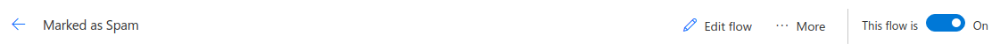

# Marked as Spam Outlook flow

Documentation for marking e-mails as Spam using Microsoft Flow.

## Problem description

Legitimate e-mails are very often moved to Spam (junk) folder and deleted after short period of time (e.g. after two weeks).

## Short solution description

If you don't want to loose important e-mail, it's better to keep e-mails marked as Spam in different folder. It's possible to do that automatically using **Microsoft Flow**.

> **Important:** Solution based on filters (e.g. when new e-mail arrives and "from" contains "@" move e-mail to "Inbox") doesn't work anymore.

## Solution description

New e-mails in "Junk Mail" folder will be automatically moved to separate folder (e.g. "Marked as Spam"). **Microsoft Flow** will be used to achieve that.

>  **Note:** Please consider this method as marking e-mails as Spam (junk). You will be able to delete those e-mails manually.

## Requirements

**Outlook.com** or **Office 365 Outlook** account.

## Limitations

Free **Microsoft Flow** accounts have **750** runs per month. If you need to handle more e-mails marked as Spam, please consider **Microsoft Flow** [paid plan](https://flow.microsoft.com/en-us/pricing/).

## Configuration

> **Important:** If you want to configure "**Office 365 Outlook**", please chose "**Office 365 Outlook**" instead of "**Outlook.com**" in all steps.
>

1. Login to [outlook.com](https://outlook.com)

2. Create new "**Marked as Spam**" subfolder (e.g. **Inbox** -> **Marked as Spam**). To do that click right button on "**Inbox**". You can chose other folder name.

3. Login to [Microsoft Flow](https://flow.microsoft.com).

4. Click on "**My flows**".

   

5. Click on "**Create from blank**".

6. Click on "**Search hundreds of connectors and triggers**".

   

7. Click on "**Outlook.com**" trigger.

   

8. Click on "**Outlook.com - When a new email arrives**".

   

9. Click on "**Sign in**". This step is optional if you already have outlook.com connected.

   

10. Click on "**Yes**" to give permission. This step is optional if you already have outlook.com connected.

  

11. Click on folder picker.

    
    
12. Click on "**Junk Email**" folder.

    

13. Click on "**Has Attachment**", choose "**Custom**" and leave blank.

    

14. Click on "**Include Attachments**", choose "**Custom**" and leave blank.

15. Click on "**New step**"

    

16. Click on "**Add an action**"

17. Search for "**outlook.com**"

    

18. Click on "**Outlook.com - Move mail**"

    

19. Click on "**Message id**" field.

    

20. Click on "**See more**"

21. Chose "**Message Id**"

    

22. Click on folder picker.

    

23. Chose subfolder you created in step 2 (e.g. **Inbox** -> **Marked as Spam**).

    
    ​
    

24. Click on "**Flow name**" field and name flow (e.g. "**Marked as Spam**").

    

25. Click on "**Save flow**".

    

26. Click on "**Done**".

    

27. Check if flow is on.

    

28. You can create other flows or logout.

## Final result

## Documentation

[Microsoft Flow documentation](https://flow.microsoft.com/en-us/documentation/getting-started/)

## Current document

[Marked as Spam Outlook Flow](https://github.com/pidziubinski/Marked-as-Spam-Outlook-Flow)

## Author

Piotr Dziubinski ([twitter](https://twitter.com/pidziubinski), [github](https://github.com/pidziubinski))
